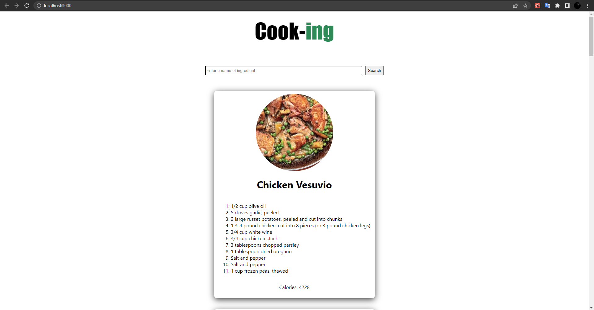
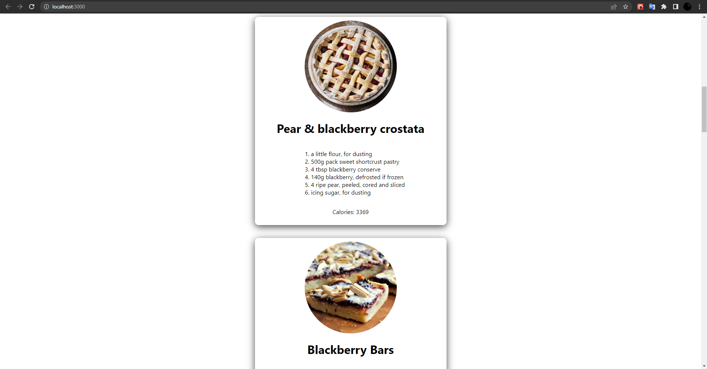

<!-- ABOUT THE PROJECT -->
## About The Project

You can list many recipes with this project. I used Edamam recipe API to show recipes. I developed this project to gain experience with react.js.

### Project Images




### Built With

* [React.js](https://reactjs.org/)
* [Node.js](https://nodejs.org/en/)

<p align="right">(<a href="#top">back to top</a>)</p>

<!-- GETTING STARTED -->
## Getting Started

To get a local copy up and running follow these simple steps.

### Prerequisites

You need to install prerequisites before running the project. Please write the following code snips on your terminal.
* npm

  ```sh
  npm install npm@latest -g
  ```

### Installation

1. Get a free API Key at [EDAMAM](https://www.edamam.com/)
2. Clone the repo

   ```sh
   git clone https://github.com/dyakupoglu/react_recipe_app.git
   ```
3. Install NPM packages

   ```sh
   npm install
   ```
4. Enter your API in `.env` file
   ```js
   REACT_APP_ID = 'Enter your Edamam API id'
   REACT_APP_KEY = 'Enter your Edamam API key'
   ```

<p align="right">(<a href="#top">back to top</a>)</p>

## License

Licensed under the [MIT License](https://github.com/dyakupoglu/react_recipe_app/blob/main/LICENSE)

<p align="right">(<a href="#top">back to top</a>)</p>
